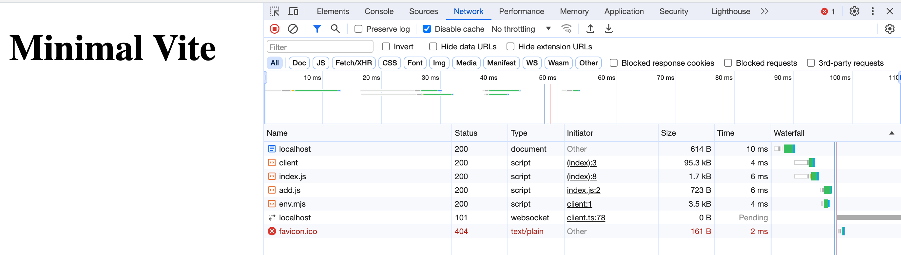
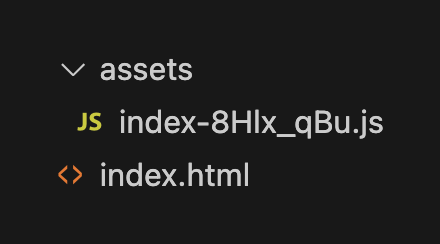
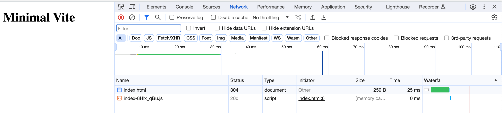

# minimal-vite-project

Displays what is the minimum to setup a project for which you can develop and run vite.

# Setup

To Create a minimal vite project, follow the steps in this section.

## Setup the project

* `npm init` to create the project
* `npm install vite` to install vite
* `index.html` file on root level

These are the minimum required steps to create a project that runs with vite. To run the project we add a start script and build it a build script:

```diff
// package.json
+    "start": "vite",
+    "build": "vite build",
```

To showcase that the project does allow to bundle javscript and load it them as modules we add:

* `src/add.js`, a file which declars an `add` function
* `index.js` file which imports the `add` function from `src/add.js` and excutes it

Then we import the `index.js` in the `html` file with the `<script />` tag and give it the `type=module`

```diff
<head>
    <meta charset="UTF-8">
    <meta name="viewport" content="width=device-width, initial-scale=1.0">
    <title>Minimal Vite</title>
+    <script type="module" src="./index.js"></script>
</head>
```

If we do not give it the `type="module"`, then it is interpreted as a `"classic script"`. That means it will be executed as soon as the js file is loaded. This can be problematic because javascript is executed before the document is loaded. If any of the javascript references the DOM to change it, it will fail. By giving it the `type="module"` it will only after the document has been loaded. 

Unlike classic scripts, module scripts require the use of the CORS protocol for cross-origin fetching. This means, that you can not just open the `html` file in a browser and it will load the javascript like it would with any other simple `html` and `index.js` file import when using the `"classic script"` approach. It will throw an CORS error.


# Project Output

The output is slightly different when running it in development vs when creating a build. 

## Running vite for devleopment with `npm start`


When we run it in development with:

```sh
npm run start
```


Vite will create a bundle with esbuild with esm module files as an output. It does not create one optimized bundle. It will load each module by itself.

Looking into the network history of our browser, we can get a better understanding what that means. It makes the following requests:



* http://localhost:5173/
* http://localhost:5173/@vite/client
* http://localhost:5173/index.js
* http://localhost:5173/src/add.js
* http://localhost:5173/node_modules/vite/dist/client/env.mjs
* ws://localhost:5173/
* http://localhost:5173/favicon.ico

Those are quite a lot of requests. If we disregard the request which vite makes to load javascript for vite to run in development mode, as well as the favicon request, we ended up with following requests:

A request to load the index.html file:
```
http://localhost:5173/
```

A request which loads our index.js file:
```
http://localhost:5173/index.js
```

A request which loads the `add.js` file from which `index.js` imports
```
http://localhost:5173/src/add.js
```

When inspecting the result of a request for a the `index.js` file, we see that it loads our module one two one without and any build optimisations:

```js
// Importing form another module.
import {add} from "/src/add.js"

console.log('welcome from a module built with vite')

const a = 6
const b = 5
const result = add(a, b)

console.log(`${a} + ${b} = ${result}`)

//# sourceMappingURL=data:application/json;base64,eyJ2ZXJzaW9uIjozLCJzb3VyY2VzIjpbImluZGV4LmpzIl0sInNvdXJjZXNDb250ZW50IjpbIi8vIEltcG9ydGluZyBmb3JtIGFub3RoZXIgbW9kdWxlLlxuaW1wb3J0IHthZGR9IGZyb20gXCIvc3JjL2FkZC5qc1wiXG5cbmNvbnNvbGUubG9nKCd3ZWxjb21lIGZyb20gYSBtb2R1bGUgYnVpbHQgd2l0aCB2aXRlJylcblxuY29uc3QgYSA9IDZcbmNvbnN0IGIgPSA1XG5jb25zdCByZXN1bHQgPSBhZGQoYSwgYilcblxuY29uc29sZS5sb2coYCR7YX0gKyAke2J9ID0gJHtyZXN1bHR9YClcblxuIl0sIm5hbWVzIjpbXSwibWFwcGluZ3MiOiJBQUFBLENBQUMsQ0FBQyxDQUFDLFNBQVMsQ0FBQyxJQUFJLENBQUMsT0FBTyxDQUFDLE1BQU0sQ0FBQztBQUNqQyxNQUFNLENBQUMsQ0FBQyxHQUFHLENBQUMsQ0FBQyxJQUFJLENBQUMsQ0FBQyxDQUFDLEdBQUcsQ0FBQyxHQUFHLENBQUMsRUFBRSxDQUFDO0FBQy9CO0FBQ0EsT0FBTyxDQUFDLEdBQUcsQ0FBQyxDQUFDLE9BQU8sQ0FBQyxJQUFJLENBQUMsQ0FBQyxDQUFDLE1BQU0sQ0FBQyxLQUFLLENBQUMsSUFBSSxDQUFDLElBQUksQ0FBQyxDQUFDO0FBQ3BEO0FBQ0EsS0FBSyxDQUFDLENBQUMsQ0FBQyxDQUFDLENBQUMsQ0FBQztBQUNYLEtBQUssQ0FBQyxDQUFDLENBQUMsQ0FBQyxDQUFDLENBQUM7QUFDWCxLQUFLLENBQUMsTUFBTSxDQUFDLENBQUMsQ0FBQyxHQUFHLENBQUMsQ0FBQyxDQUFDLENBQUMsQ0FBQyxDQUFDO0FBQ3hCO0FBQ0EsT0FBTyxDQUFDLEdBQUcsQ0FBQyxDQUFDLENBQUMsQ0FBQyxDQUFDLENBQUMsQ0FBQyxDQUFDLENBQUMsQ0FBQyxDQUFDLENBQUMsQ0FBQyxDQUFDLENBQUMsQ0FBQyxDQUFDLENBQUMsTUFBTSxDQUFDLENBQUMsQ0FBQztBQUN0QzsifQ==
```


These are still a lot of requests. In other bundlers the approach is to create one optimized bundle and then load the application. This could be achieved by moving the javascript code from `add.js` and `index.js` into one file. That would results in less request.

But because when we are in development, we do not care if there are a lot of request. The reason is that request to localhost are fast. Thus when we have no performance drawback from it. But we have the benefit of a really fast build and thus we see the output of our changes a lot faster.

When we build the application for production, the request are no longer to localhost but to some webserver. If the application makes a request for each module that is import from, it can slow the application down. That's why there is a different approach for when building for production.

## Building for production

We can build for production with:

```
npm run build
```

Vite uses [rollup.js](https://rollupjs.org/) to optimise the build for production. When building for production, we want to create bigger chunks of code, so that the amount of requests to load all the modules can be reduced.



The build output ist added to the `/dist` folder. The output is just two files, an `index.html` and a `src/index.js` file. The code our `index.js` and `add.js` file have been bundled into one file. Because `type=module` is used, we can not just open the `index.html` file and see the application. When using `type=module` it requires the file to be loaded with the use of the CORS protocol. We can achieve that by serving the `index.html` with a server.

To spin up a quick http server we use the `http-server` package:

```sh
cd /dist
npx http-server -o index.html
```



When loading the production applicaitons, only two requests are made.

* http://127.0.0.1:8081/index.html
* http://127.0.0.1:8081/assets/index-8Hlx_qBu.js

When inspecting the served `index-8Hlx_qBu.js` file, we see that the previous functionality that has been in two different modules, have been bundled together into one chunk:

```js
// `index-8Hlx_qBu.js` bundle output
(function() {
    const r = document.createElement("link").relList;
    if (r && r.supports && r.supports("modulepreload"))
        return;
    for (const e of document.querySelectorAll('link[rel="modulepreload"]'))
        i(e);
    new MutationObserver(e=>{
        for (const t of e)
            if (t.type === "childList")
                for (const o of t.addedNodes)
                    o.tagName === "LINK" && o.rel === "modulepreload" && i(o)
    }
    ).observe(document, {
        childList: !0,
        subtree: !0
    });
    function l(e) {
        const t = {};
        return e.integrity && (t.integrity = e.integrity),
        e.referrerPolicy && (t.referrerPolicy = e.referrerPolicy),
        e.crossOrigin === "use-credentials" ? t.credentials = "include" : e.crossOrigin === "anonymous" ? t.credentials = "omit" : t.credentials = "same-origin",
        t
    }
    function i(e) {
        if (e.ep)
            return;
        e.ep = !0;
        const t = l(e);
        fetch(e.href, t)
    }
}
)();
function u(s, r) {
    return s + r
}
console.log("welcome from a module built with vite");
const n = 6
  , c = 5
  , f = u(n, c);
console.log(`${n} + ${c} = ${f}`);
```